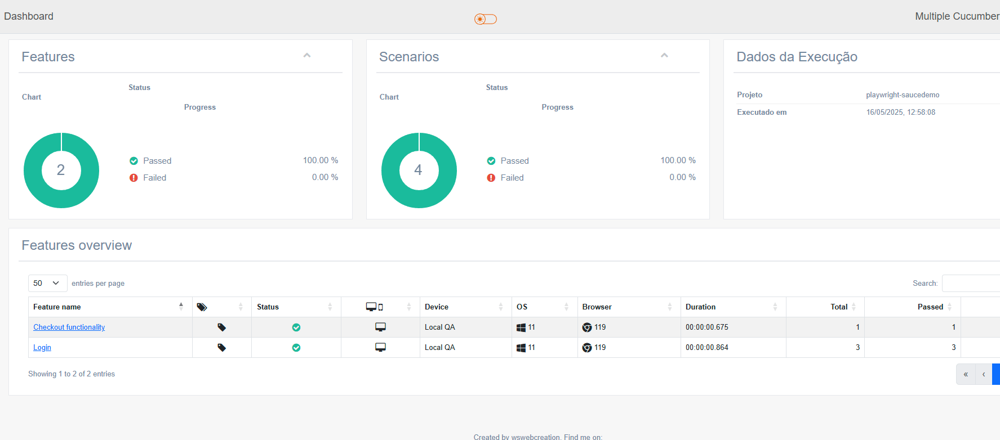

---

## 📄 `automation-backend/README.md` – RestAssured

```markdown
# RestAssured API Tests

Este módulo executa testes de API usando RestAssured + JUnit.

## 🔍 Testes realizados
- Necessario instalar o JAVA 17+

## 🔍 Testes realizados

- Verificação de status 200
- Tempo de resposta máximo
- Validação de campos obrigatórios no JSON
- Teste com parâmetros inválidos

## ▶️ Como rodar

```bash
mvn test
```

## ▶️ Execução no gitAction
Para executar os testes de Backend dentro do gitAction 
Acesse o link https://github.com/alcaldeira/outsera-qa-test/actions
Executa a action [Backend API Tests]

Após execução da action será gerado uma página com o relatório
[Relatório de Testes](https://alcaldeira.github.io/outsera-qa-test/backend-report/)
