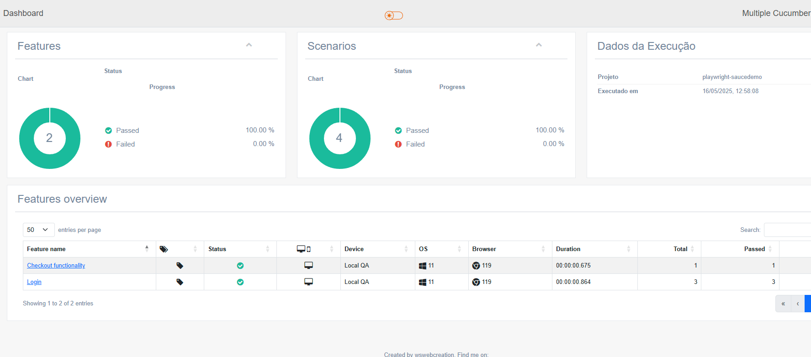

---
## 📄 `automation-frontend/README.md` – Playwright
```markdown

# Playwright Tests - Frontend

Este projeto realiza testes automatizados E2E na aplicação [SauceDemo](https://www.saucedemo.com).

## ✅ Funcionalidades testadas

- Login com credenciais válidas
- Adicionar produto ao carrinho
- Remover produto do carrinho
- Finalizar compra
- Ordenação de produtos por preço

## 📁 Estrutura

- `features/pages/`: Page Objects
- `/features`: Casos de teste
- `support/`: Utilitários
- `playwright.config.js`: Configuração base
- `cucumber.js`: Configurações do cucumber

## ▶️ Instala dependencias 
# Para exec
```bash
npm install
```

# Para executar todos os testes
```bash
npm run test
```

# Para executar testes por tag
```bash
npx cucumber-js --tags "@sua-tag"
Exemplo
npx cucumber-js --tags "@login"  
```

# Gerar relatório após execução dos testes
```bash
npm run report:generate
npm run report:open
```

## ▶️ Execução no gitAction
Para executar o teste de E2E dentro do gitAction 
Acesse o link https://github.com/alcaldeira/outsera-qa-test/actions
Executa a action [BDD Tests]
Após execução será gerado um link no git page com o relatório
[Relatório de Testes](https://alcaldeira.github.io/outsera-qa-test/)


## Caso queira baixar e subir relatório local após Download

1. Baixar arquivo de relatório após execução dos testes
2. acessar o arquivo baixado
3. Executar o comando no terminal
```bash
start index.html
```